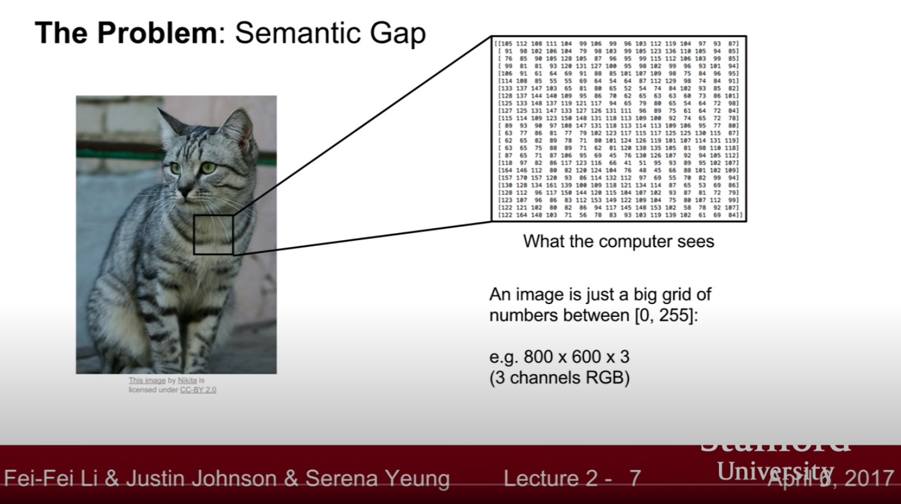

### **CS231n - Lecture 2**: Image classification

- assignment 1: kNN, linear classifiers, SVM, softmax, 2-layer NN, image features

- discrete set of category labels - pick one to label a picture
- picture of a cat vs what the computer sees, an 800px x 600px x 3 channels (RGB) matrix: 
