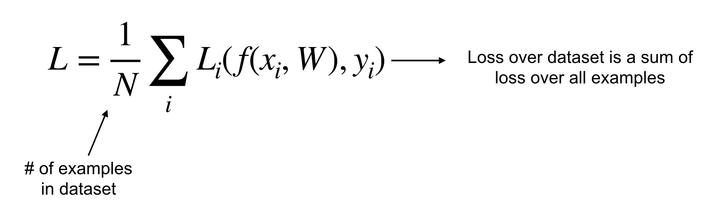

### **CS231n - Lecture 3**: Loss functions and optimization

- starting from lecture 2 with a linear classifier, we need to:
  1. define a loss function to quantify the "goodness" of score across training DataFrame
  2. find an efficient way to optimize parameters that minimize the loss function
  ***A loss function tells us how good our current classifier is***

  *given a dataset of examples:*
  
  
  ***GOAL***: find a $W$ that **minimizes the loss**

#### Multiclass support vector machine (SVM)
  - sum over all categories, $y$ except for the true category, $y_i$
