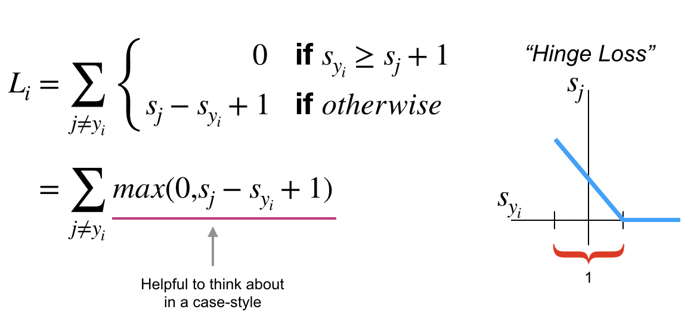
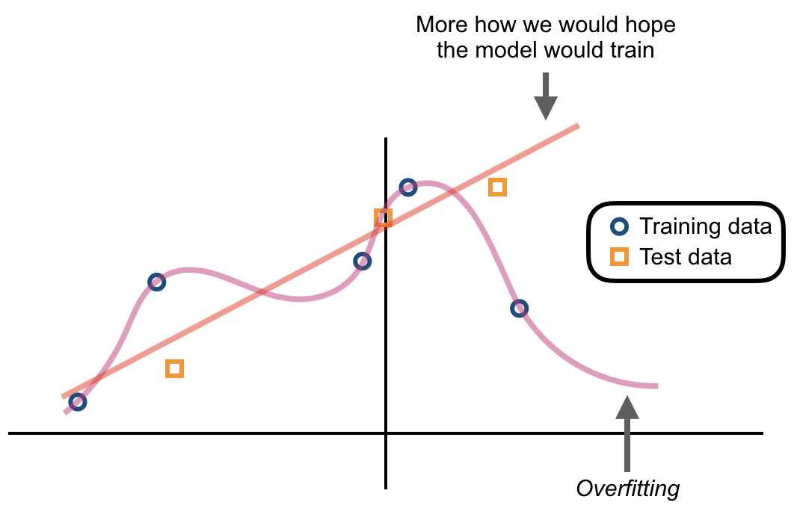
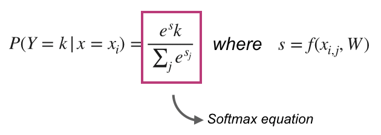

### **CS231n - Lecture 3**: Loss functions and optimization

- starting from lecture 2 with a linear classifier, we need to:
  1. define a loss function to quantify the "goodness" of score across training DataFrame
  2. find an efficient way to optimize parameters that minimize the loss function
  ***A loss function tells us how good our current classifier is***

  *given a dataset of examples:*
  
  

- ***GOAL***: find a $W$ that **minimizes the loss**

#### Multiclass support vector machine (SVM)
  - sum over all categories, $y$ except for the true category, $y_i$. all categories that are not the true label are compared with $y_i$.
  - *scores vector shorthand*: $s = f(x_i,W)$

  

  - *loss goes down linearly until we hit the safety margin, after which, loss = 0.*
  - in your loss function, you might use a square loss to exaggerate the effect compared to a linear loss functions

  - ***vectorized example of Numpy code for multiclass SVM loss***

  - $L(W) = \frac{1}{N} \sum_{i=1}^{N}L_i(f(x_i,W),y_i) + \lambda R (W)$

    ```
    def L_i_vectorized( x, y, W ):
      scores     = W.dot(x)
      margines   = np.maximum(0, scores - scores[y] + 1)
      margins[y] = 0
      loss_i     = np.sum(margins)

      return loss_i
    ```  
    - if $L = 0$, is $W$ unique? ***NO!*** $2*W$ also has $L=0$!
    - we have only told our classifier to calculate $loss$ on the training data; we don't worry about $2W$ or some other $W$.

    

**L2 regularization**

  - There are many types of regularization used in practice
      - L2 (eculidian) regularization is common; $R(W) = \sum_k \sum_l W_{k_i,l}^2$
      - L2 regularization with *weight decay*; $R(W) = \sum_k \sum_l W_{k,l}^2$
          - $x = [1, 1, 1, 1]$
          - $w_1 = [1, 0, 0, 0]$
          - $w_2 = [0.25, 0.25, 0.25, 0.25]$
          - $W_1^T x = W_2^T x = 1$

          - ***for Bayesians***: L2 regularization correlates to MAP inference using a Gaussian prior on $W$

      - *also popular in deep learning: **softmax classifier*** (multinomial logistic regression) where scores are un-normalized log probabilities of the classes

      

      - *each probability is between 0 and 1; it sums across all classes to be equal to 1.*

      - $L_i = -logP(y = y_i | x = x_i)$ and in summary $L_i = -log(\frac{e^s_{y_i}}{\sum_j e^{s_j}})$

      - what are the $min()$ and $max()$ values of softmax loss? 0 and $inf$, $[0,inf)$
      - SVM stops trying to improve a class once you pass an arbitrary margin of goodness, but softmax will always try to keep minimizing.

**Recap**

  - some data (x,Y)
  - score function: $s = f(x, W) = W_x and we have a loss function (SVM or softmax) with a regularization term, $R(W)$ (penalizas model complexity) added to the loss calculation to get the ***full loss***.

  - *Question*: so, how do we find $W$ such that it minimizes loss?
  - *Answer*: optimization, there are two strategies.
    1. **random search** - a ***very bad idea***
    2. follow the slope via load topography - this is generally the most followed strategy.
