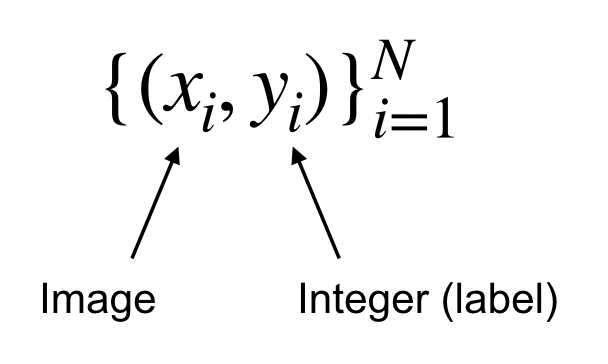

### **CS231n - Lecture 3**: Loss functions and optimization

- starting from lecture 2 with a linear classifier, we need to:
  1. define a loss function to quantify the "goodness" of score across training DataFrame
  2. find an efficient way to optimize parameters that minimize the loss function
  ***A loss function tells us how good our current classifier is***

  *given a dataset of examples:*
  
  

- ***GOAL***: find a $W$ that **minimizes the loss**

#### Multiclass support vector machine (SVM)
  - sum over all categories, $y$ except for the true category, $y_i$. all categories that are not the true label are compared with $y_i$.
  - *scores vector shorthand*: $s = f(x_i,W)$

  

  - *loss goes down linearly until we hit the safety margin, after which, loss = 0.*
  - in your loss function, you might use a square loss to exaggerate the effect compared to a linear loss functions

  - ***vectorized example of Numpy code for multiclass SVM loss***

  - $L_i = \sum_{j≠y_i}max(0, s_j - s_{y_i} + 1)

    ```
    def L_i_vectorized( x, y, W ):
      scores     = W.dot(x)
      margines   = np.maximum(0, scores - scores[y] + 1)
      margins[y] = 0
      loss_i     = np.sum(margins)

      return loss_i
    ```  
